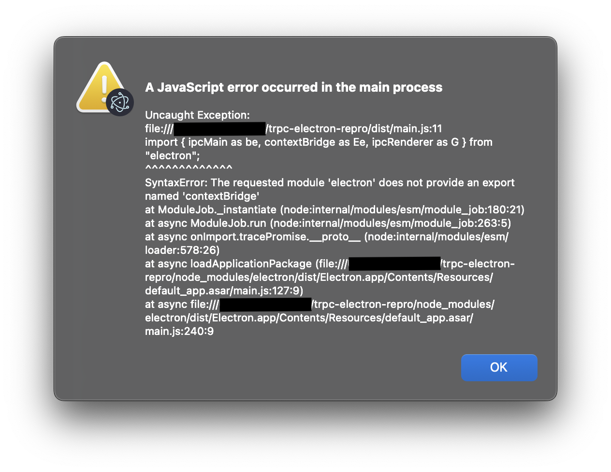

```shell
App threw an error during load
file:///***/trpc-electron-repro/dist/main.js:11
import { ipcMain as be, contextBridge as Ee, ipcRenderer as G } from "electron";
                        ^^^^^^^^^^^^^
SyntaxError: The requested module 'electron' does not provide an export named 'contextBridge'
    at ModuleJob._instantiate (node:internal/modules/esm/module_job:180:21)
    at async ModuleJob.run (node:internal/modules/esm/module_job:263:5)
    at async onImport.tracePromise.__proto__ (node:internal/modules/esm/loader:578:26)
    at async loadApplicationPackage (file:///***/trpc-electron-repro/node_modules/electron/dist/Electron.app/Contents/Resources/default_app.asar/main.js:127:9)
    at async file:///***/trpc-electron-repro/node_modules/electron/dist/Electron.app/Contents/Resources/default_app.asar/main.js:240:9
```



---

see `./main.ts#L6`
possibly related: https://github.com/electron/electron/issues/41449#issuecomment-1967614240

---

```shell
# node 22
npm i
npm start
````
